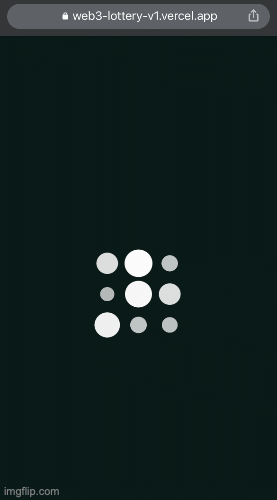

# Crypto Lottery System - WEB3
this repo is a managment system for any form of lottery games that involves the drawing of numbers at random for a prize and handing out tickets.

the mechanism design based on token economics and insures that no prospective owner-occupant has an unfair advantage in the determination of winner.


> **Note:** This DApp is for interview purposes only. altho it's fully functional, however, used coin has no value.


## Built With 
### BackEnd


### FrontEnd


## Demo

### Here is a working live demo: [Web3-lottery-v1](http://web3-lottery-v1.vercel.app)
> Login with your Crypto Wallet




### Have a look for Deployed backend SmartContract (API) here: [BackEnd API](https://thirdweb.com/0x741179Acd84FeDEb7315a8ce4149f5cEF914185c/Lottery)


<!-- GETTING STARTED -->
## Getting Started

This is how you may set up your project locally.
To get a local copy up and running follow these simple steps.

### Prerequisites
  ```sh
  MetaMask account - cryptocurrency wallet 
  ```
  ##### MetaMask only supports Chrome, Firefox, Edge, and Brave browsers and is not available on Safari
  
  
### Installation


1. Get a free API Key at [thirdweb.com](thirdweb.com)
2. Clone this repo
   ```sh
   git clone https://github.com/omarsa999/web3-lottery.git
   
   ```
3. Install NPM packages
   ```sh
   cd web3-lottery
   npm install
   ```
4. Deploy the Backend on ThirdWeb
using **Thirdweb**'s SDK deploy feature, a Powerful SDK to integrate decentralized and Web3 technologies into the backend [Read More](https://portal.thirdweb.com/)
   ```sh
   git clone github.com/omarsa999/lottery-smart-contract.git
   ```
5. Enter your API in `config.js`
   ```js
   const API_KEY = 'ENTER YOUR API';
  
  
## Usage
### wrap your app with thiredweb Provider to establish a connection 

<p align="center">

</p>


## Features

### [full API can be found here](https://thirdweb.com/0x741179Acd84FeDEb7315a8ce4149f5cEF914185c/Lottery)

### Write to BlockChain:
* BuyTickets
* DrawWinnerTicket
* RefundAll
* WithdrawCommission
* WithdrawWinnings
* restartDraw

### Read from BlockChain
* CurrentWinningReward
* IsWinner
* RemainingTickets
* checkWinningsAmount
* duration
* expiration
* getTickets
* getWinningsForAddress
* lastWinner
* operatorTotalCommission
* and more ..


<!-- CONTACT -->
## Contact

[@OmarSa] - hello@omarsa.tech
[omarsa.tech](Omarsa.tech)


> This repository was extended from its original smart contract repo: https://github.com/drord9/Lottery

### Research inspiration
[Web3 Meets Behavioral Economics](https://arxiv.org/abs/2206.03664)

[Next.js]: https://img.shields.io/badge/solidity-000000?style=for-the-badge&logo=solidity&logoColor=white
[Next-url]: https://nextjs.org/

